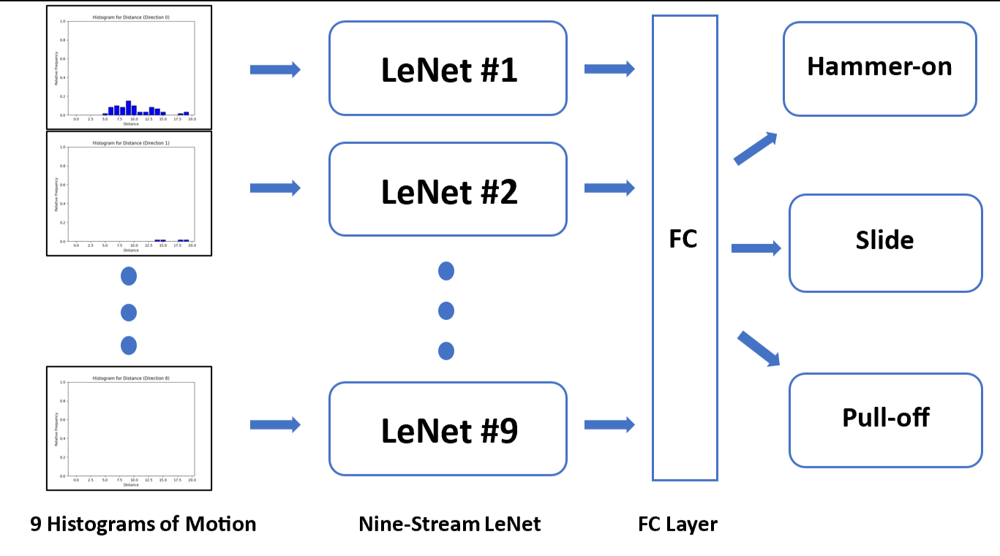

# Honours research project: Guitar Technique Detection Based on Histogram of Motions with Multi-Stream CNN Classifier 

## Summary
This repository contains research code for training a multi-stream CNN on histogram-based motion data.

### Brief Descriptions of Experimental Steps: 
1. Collect hand images and guitar technique video clips (1~3 secs)
- Used: YouTube for image and video clip collection.
2. Preprocess Data 
- Used: SegmentAnything https://github.com/facebookresearch/segment-anything for hand image annotation. 

3. Fine-tune YOLO v8n model with hand images

    

4. Segment a hand from the background of video clips
   
    
      
6. Extract optical flow from those segmented area and store the result for model training
7. Build, Train, and Test the model
    
## Project Structure
#### datasets/ -> required & processed datasets.
#### model/ -> model weights & training loss plots.
#### utils/ -> required util modules. (media-pipe might be integrated later)
#### config.yaml -> required folder path used in experiements.
#### reproduce_research.ipy -> reproduceble jupyter notebook for preprocessing & training the model. 

## Setup
1. Install CUDA & Setup (ver 11.8)
2. > nvcc --version
3. This command should show something like this on cmd: 
    > nvcc: NVIDIA (R) Cuda compiler driver
    Copyright (c) 2005-2022 NVIDIA Corporation
    Built on Wed_Sep_21_10:41:10_Pacific_Daylight_Time_2022
    Cuda compilation tools, release 11.8, V11.8.89
4. > git clone https://github.com/Keizo410/Computer_Vision_Based_Acoustic_Guitar_Technique_Detection.git
5. > pip install jupyter notebook 
(if you didn't have on your environment.)
6. > jupyter notebook

*if you don't like messing with your python environement, I strongly suggests to create conda env or something and export it as python kernel by 

> python -m ipykernel install --user --name=your_env_name --display-name "Python your_env_name"
